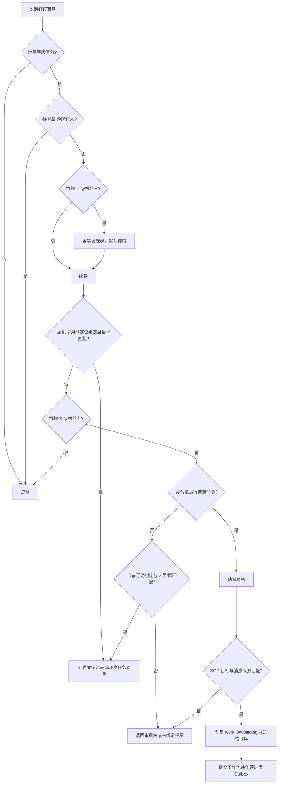

# 钉钉 SOP 单通知对象 V1 实现说明

> 本文记录已经交付的 V1 历史实现。当前多任务绑定方案已将通知对象从 SOP 移到任务定义，并取消机器人全局单任务槽；现行设计请阅读 `DINGTALK_MULTI_TASK_BINDING_IMPLEMENTATION.zh-CN.md`。

## 1. 文档用途

本文用于在另一台电脑上独立分析分支 `codex/dingtalk-sop-target-v1` 的实现，覆盖需求边界、设计原理、数据库迁移、关键代码、运行流程、测试结果、部署条件和重点审查项。

本次实现元数据：

| 项目 | 值 |
| --- | --- |
| 基线分支 | `codex/multi-supervisor-phase-b` |
| 基线提交 | `d25731f1829cc3ac65805c716a7476dc11d1d5a0` |
| 实现分支 | `codex/dingtalk-sop-target-v1` |
| 功能提交 | `1bb22a6` `feat: add DingTalk SOP notification targets` |
| 主要模块 | `services/role-task-config-center/` |
| 数据库迁移 | `V13__add_dingtalk_notification_targets.sql` |
| 未修改模块 | Python 工作流服务 `8080`、Java 监控中心 `8090` |

在另一台电脑上获取并查看差异：

```sh
git fetch origin
git switch codex/dingtalk-sop-target-v1
git diff d25731f1829cc3ac65805c716a7476dc11d1d5a0..1bb22a6
git show --stat --oneline 1bb22a6
```

## 2. 最终需求边界

本次实现按以下产品决定收敛，没有扩展成通用的多机器人、多接收人或消息订阅系统：

1. 一个部署仍只有一套钉钉机器人配置。
2. 机器人仍固定绑定一个“任务定义”，任务定义再引用一个 SOP；不是直接把机器人外键绑定到 SOP。
3. SOP 最多选择一个钉钉通知对象，类型只能是 `PERSON` 或 `GROUP`，人员与群严格二选一。
4. 为兼容已有 SOP 和非钉钉场景，SOP 的通知对象允许为空；但钉钉机器人启用和启动固定任务时，目标必须存在、启用、可用，并属于当前 Client ID。
5. 人员来自管理员手动同步钉钉企业通讯录，不做定时同步。
6. 群聊不能通过通讯录同步：机器人在某群首次被 @ 时自动发现该群，登记后默认停用，由管理员确认并启用。
7. 只有从钉钉目标人员或群发起的运行才建立钉钉绑定、推送进度和接收控制；从 8091 页面启动的同一任务不回推钉钉。
8. 目标群内所有成员均可通过 @、回复或引用消息对话和控制；其他群不能启动或控制。
9. 目标人员可以在机器人单聊中直接发送“运行”、问题或控制指令，不要求 @；其他人员不能启动或控制。
10. 个人通知只使用文本或 Markdown，不创建互动卡片；群聊继续支持可选互动卡片。
11. 飞书与钉钉互斥、全局同时最多一个机器人任务、消息幂等、半自动流转和二次确认等既有规则保持不变。

### 2.1 明确未做的内容

- 没有实现一个机器人绑定多个任务或多个 SOP。
- 没有实现一个 SOP 同时通知多个人或多个群。
- 没有定时同步通讯录。
- 没有主动拉取企业群列表。
- 没有个人互动卡片。
- 没有给 8090 增加编辑或控制接口。
- 没有让浏览器直接访问钉钉、Python `8080` 或数据库。
- 没有改变 Python 工作流协议和 SQLite 状态模型。

## 3. 总体设计

核心关系如下：

```text
钉钉机器人设置
    │ 固定 taskDefinitionId
    ▼
任务定义
    │ 引用 sopId
    ▼
SOP
    │ 可选且最多一个 dingtalkTargetId
    ▼
钉钉通知对象
    ├── PERSON：钉钉 userId
    └── GROUP：钉钉 openConversationId
```

运行时不反复读取 SOP 当前配置来决定消息发往哪里，而是在钉钉成功启动工作流时，把目标快照写入钉钉工作流绑定：

```text
SOP 当前目标
    │ 启动时校验并冻结
    ▼
workflow binding
    ├── target_type
    ├── target_external_id
    └── target_name
          │
          ▼
outbox 每条消息再次保存 target_type + target_external_id
```

这样做有两个目的：

- 管理员后来修改 SOP、停用对象或切换应用时，已经运行的任务不会突然改发到新对象。
- Outbox 在断线重试时不依赖易变的当前 SOP 配置，仍能按创建消息时的目标补发。

## 4. 行为矩阵

| 场景 | 能否启动 | 能否对话/控制 | 推送形式 |
| --- | --- | --- | --- |
| SOP 目标为群，目标群成员 @ 机器人 | 是 | 是 | 文本/Markdown；配置模板时可用互动卡片 |
| SOP 目标为群，目标群成员回复/引用该任务消息 | 不作为新启动入口 | 是 | 同上 |
| SOP 目标为群，其他群 @ 机器人 | 否 | 否 | 只返回无权限/未绑定提示 |
| SOP 目标为人员，该人员单聊机器人 | 是，无需 @ | 是，无需 @ | 文本或 Markdown |
| SOP 目标为人员，其他人员单聊机器人 | 否 | 否 | 文本提示 |
| 8091 页面运行固定任务 | 是，沿用原页面能力 | 不建立钉钉控制绑定 | 不推送钉钉 |
| SOP 未选择目标或目标失效 | 钉钉启动被拒绝 | 否 | 普通中文错误提示 |
| 机器人启用但固定任务没有有效目标 | 启用/启动失败 | 否 | 配置页面或日志显示稳定错误状态 |

## 5. 数据模型与迁移

### 5.1 新表 `codex_sop_dingtalk_targets`

迁移文件：[V13__add_dingtalk_notification_targets.sql](../services/role-task-config-center/src/main/resources/db/migration/V13__add_dingtalk_notification_targets.sql)

| 字段 | 含义 |
| --- | --- |
| `id` | 本系统 UUID |
| `client_id` | 对象所属钉钉应用 Client ID，用于应用隔离 |
| `target_type` | `PERSON` 或 `GROUP` |
| `external_id` | 人员 `userId` 或群 `openConversationId` |
| `display_name` | 页面显示名称，可由管理员修改 |
| `department_display` | 人员所属部门的展示文本 |
| `source` | `DIRECTORY` 表示通讯录同步，`OBSERVED` 表示群消息发现 |
| `available` | 钉钉侧当前是否可用；通讯录中消失的人员会变为 `false` |
| `enabled` | 管理员是否允许 SOP 选择；新对象默认 `false` |
| `deleted` | 软删除标记 |
| `last_synced_at` | 最近同步或发现时间 |
| `created_at` / `updated_at` | 审计时间 |

唯一约束为：

```text
(client_id, target_type, external_id)
```

同一个应用下，同一个人员或群不会被重复创建；人员 ID 与群 ID 即使字符串相同，也因类型不同而互不冲突。

### 5.2 SOP 关联

`codex_sop_sops` 新增可空外键：

```sql
dingtalk_target_id VARCHAR(36) NULL
```

实体中使用 `@ManyToOne`：

```java
@ManyToOne
@JoinColumn(name = "dingtalk_target_id")
DingTalkTargetEntity dingtalkTarget;
```

选择一个对象由单个外键天然保证，不需要建立 SOP 与目标的多对多关系。

### 5.3 运行绑定和 Outbox 快照

`codex_sop_dingtalk_workflow_bindings` 新增：

- `target_type`
- `target_external_id`
- `target_name`

`codex_sop_dingtalk_outbox` 新增：

- `target_type`
- `target_external_id`

这些字段在 V13 中保持可空，以避免对已有数据执行破坏性迁移。历史记录统一回填为：

```text
target_type = GROUP
target_external_id = conversation_id
target_name = 历史群聊
```

Java 映射还保留空值回退逻辑：旧记录的类型为空时按 `GROUP` 处理，目标 ID 为空时使用原 `conversationId`。数据库回填与代码回退形成双重兼容。

### 5.4 删除规则

通知对象采用软删除。若对象仍被未删除 SOP 引用，删除操作会返回冲突，只允许停用：

```java
if (sops.existsByDingtalkTarget_IdAndDeletedFalse(id)) {
  throw new ConflictFailure("通知对象已被 SOP 引用，只能停用。");
}
```

## 6. 领域层实现

### 6.1 主要类

| 文件 | 职责 |
| --- | --- |
| [DingTalkTargetEntity.java](../services/role-task-config-center/src/main/java/com/codexflow/configcenter/domain/DingTalkTargetEntity.java) | JPA 通知对象实体 |
| [DingTalkTargetRepository.java](../services/role-task-config-center/src/main/java/com/codexflow/configcenter/domain/DingTalkTargetRepository.java) | 按 Client ID 列表、按类型和外部 ID 查重 |
| [DingTalkTargetDirectory.java](../services/role-task-config-center/src/main/java/com/codexflow/configcenter/domain/DingTalkTargetDirectory.java) | 人员同步、群发现、启停、删除与选择校验 |
| [SopEntity.java](../services/role-task-config-center/src/main/java/com/codexflow/configcenter/domain/SopEntity.java) | 保存唯一通知对象外键 |
| [ConfigService.java](../services/role-task-config-center/src/main/java/com/codexflow/configcenter/domain/ConfigService.java) | SOP 保存和固定任务启动前的领域校验 |
| [DomainJsonMapper.java](../services/role-task-config-center/src/main/java/com/codexflow/configcenter/domain/DomainJsonMapper.java) | 在 SOP API 中输出目标 ID 和摘要 |

### 6.2 人员同步算法

`DingTalkTargetDirectory.syncPeople` 的处理过程：

1. 校验远端人员的 `userId` 和姓名。
2. 用 `Set<String>` 对一次同步内的重复人员去重。
3. 按 `(clientId, PERSON, userId)` 查找本地对象。
4. 新人员创建为 `DIRECTORY` 来源，并保持 `enabled=false`。
5. 已有人员更新姓名、部门、可用状态和同步时间，但不覆盖管理员的启用选择。
6. 遍历本应用现有人员；本轮没有出现且原先可用的人员标记为 `available=false`、`enabled=false`。
7. 返回新增、更新、失效、总人数和同步时间。

关键安全性质：同步失败时，远端调用会先抛异常，`syncPeople` 不会收到空集合，因此不会因为网络错误批量把人员标记失效。只有钉钉接口成功返回的空结果才会被当成真实空通讯录处理。

### 6.3 群发现算法

`DingTalkTargetDirectory.discoverGroup` 使用 `(clientId, GROUP, conversationId)` 幂等查找：

- 第一次发现时创建 `source=OBSERVED`、`enabled=false` 的对象。
- 有群名称则保存群名称；没有名称时生成“待命名群聊 + ID 前缀”。
- 重复 @ 不会创建重复对象，只刷新可用状态和发现时间。
- 自动发现不等于授权，管理员仍需在页面启用。

### 6.4 SOP 保存校验

`SopSaveRequest` 新增可空 `dingtalkTargetId`。保存 SOP 时：

```java
String targetId = normalizeNullable(body.dingtalkTargetId());
sop.dingtalkTarget =
    targetId == null ? null : dingtalkTargets.requiredSelectable(targetId);
```

`requiredSelectable` 拒绝已删除、未启用或不可用的对象。旧构造函数保留兼容重载，使现有 Java 测试和调用方不必一次性全部传入新字段。

### 6.5 固定任务目标校验

`ConfigService.requireDingTalkTargetForTask(taskId, clientId)` 按以下顺序验证：

1. 任务定义存在且未删除。
2. 任务引用的 SOP 已选择通知对象。
3. 对象没有删除，且 `enabled=true`、`available=true`。
4. 对象的 `clientId` 等于当前机器人 Client ID。

该校验在三个位置生效：

- 保存并启用机器人配置时。
- 机器人长连接启动时。
- 每次接收“运行”命令并预留工作流时。

多层校验用于覆盖配置变更、重启和长连接运行期间目标失效等情况。

任务定义和 SOP 的启用状态沿用既有边界：保存机器人配置时会拒绝停用任务，真正创建运行时 `WorkflowRunStore.prepareLatest` 会再次拒绝已停用的任务或 SOP。

## 7. 管理接口

入口控制器：[DingTalkTargetController.java](../services/role-task-config-center/src/main/java/com/codexflow/configcenter/web/DingTalkTargetController.java)

应用服务：[DingTalkTargetAdminService.java](../services/role-task-config-center/src/main/java/com/codexflow/configcenter/integration/dingtalk/DingTalkTargetAdminService.java)

| 方法 | 地址 | 行为 |
| --- | --- | --- |
| `GET` | `/api/dingtalk/targets` | 列出当前 Client ID 下未删除对象；尚未配置 Client ID 时返回空数组 |
| `POST` | `/api/dingtalk/targets/sync-people` | 使用已保存凭据读取通讯录并同步人员 |
| `PUT` | `/api/dingtalk/targets/{id}` | 修改名称和启用状态 |
| `DELETE` | `/api/dingtalk/targets/{id}` | 软删除未被 SOP 引用的对象 |
| `POST` | `/api/dingtalk/targets/{id}/test` | 向人员或群发送测试文本 |

更新请求示例：

```json
{
  "displayName": "研发负责人",
  "enabled": true
}
```

人员同步响应示例：

```json
{
  "created": 12,
  "updated": 38,
  "unavailable": 1,
  "total": 50,
  "syncedAt": "2026-09-03T03:00:00Z"
}
```

这些接口仍属于 8091 的内网页面 API，没有新增公网回调接口。

## 8. 钉钉传输层

### 8.1 抽象接口扩展

[DingTalkTransport.java](../services/role-task-config-center/src/main/java/com/codexflow/configcenter/integration/dingtalk/DingTalkTransport.java) 新增：

```java
sendPersonText(userId, text)
sendPersonMarkdown(userId, title, markdown)
listPeople(clientId, clientSecret)
```

它们以默认方法加入，既有测试替身不必立即实现；生产实现由 `OfficialDingTalkTransport` 覆盖。

### 8.2 个人消息

[OfficialDingTalkTransport.java](../services/role-task-config-center/src/main/java/com/codexflow/configcenter/integration/dingtalk/OfficialDingTalkTransport.java) 使用：

```text
POST /v1.0/robot/oToMessages/batchSend
```

请求包含：

- 当前应用 Client ID 作为 `robotCode`。
- 单个目标 `userId` 放入 `userIds` 数组。
- `sampleText` 或 `sampleMarkdown` 作为 `msgKey`。
- 序列化后的 `msgParam`。

### 8.3 通讯录同步

实现先获取应用访问令牌，再从根部门 `1` 开始广度遍历组织结构：

```text
/topapi/v2/department/listsubid  获取子部门
/topapi/v2/user/list             分页获取部门人员
/topapi/v2/department/get        获取部门名称
```

人员可能属于多个部门，因此使用 `userId` 聚合并去重，部门名排序后使用顿号拼接为页面展示文本。每个部门的人员列表按 `cursor` 和 `has_more` 翻页。

### 8.4 入站模型扩展

`DingTalkModels.Message` 新增 `conversationTitle`，用于自动发现群时保存可读名称。原八参数构造函数保留，用于兼容旧测试。

`Binding` 和 `Outbox` 分别新增目标类型、目标外部 ID 等字段，并保留旧构造函数；旧构造默认按群聊解释。

## 9. 启动、授权与会话路由

主要协调器：[DingTalkBotCoordinator.java](../services/role-task-config-center/src/main/java/com/codexflow/configcenter/integration/dingtalk/DingTalkBotCoordinator.java)

持久化事务边界：[DingTalkStore.java](../services/role-task-config-center/src/main/java/com/codexflow/configcenter/integration/dingtalk/DingTalkStore.java)

### 9.1 入站消息处理流程



### 9.2 目标匹配规则

人员：

```java
!"2".equals(message.conversationType())
    && targetExternalId.equals(message.senderUserId())
```

群聊：

```java
"2".equals(message.conversationType())
    && targetExternalId.equals(message.conversationId())
```

因此人员授权基于发送者 `userId`，群授权基于 `openConversationId`，不是基于显示名称。

### 9.3 启动预留顺序

`DingTalkStore.reserveStart` 保留原有幂等和单任务锁：

1. 先按 `(clientId, triggerMessageId)` 判断重复消息。
2. 对机器人状态行加锁。
3. 如果已有活动工作流，返回 `busy`。
4. 解析固定任务的 SOP 目标。
5. 校验消息来源与目标匹配；不匹配返回 `unauthorized`。
6. 生成不可变工作流提交快照。
7. 创建钉钉工作流绑定，写入目标快照。
8. 占用全局机器人执行槽。

目标校验放在创建运行快照之前，未授权请求不会创建无用的 `workflowId` 或运行记录。

### 9.4 为什么 Web 运行不推送钉钉

Web 运行仍走原 `WorkflowRunService` 和任务运行接口，不调用 `DingTalkStore.reserveStart`，因此不会创建 `codex_sop_dingtalk_workflow_bindings`。钉钉事件轮询只遍历该绑定表中的记录，自然不会把 Web 发起的运行推送到钉钉。

这是一种来源隔离，而不是在工作流提交 JSON 中增加钉钉标记，所以没有改变 8080 协议。

### 9.5 群和人员的交互差异

- 群聊顶层消息必须 @ 机器人；普通群消息不进入任务助手。
- 群聊可以回复或引用启动消息、进度消息或进度卡定位历史绑定。
- 个人单聊不要求 @；没有回复关系时，可以通过当前活动绑定定位工作流。
- 个人和群都必须先通过冻结目标校验，其他发送者或群不能借用全局活动任务。
- 群互动卡片按钮仍按绑定的 `conversationId` 工作；人员永远不进入卡片分支。

## 10. Outbox 投递原理

每条新 Outbox 记录保存：

```text
workflowId
conversationId
targetType
targetExternalId
replyToMessageId
messageKind
payload
```

投递时按目标类型分流：

```text
PERSON + text      -> sendPersonText
PERSON + markdown  -> sendPersonMarkdown
GROUP  + text      -> sendText
GROUP  + markdown  -> sendMarkdown
GROUP  + card      -> sendCard / updateCard
```

`supportsCard` 的条件是：

```java
"GROUP".equals(binding.targetType())
    && !properties.getCardTemplateId().isBlank()
```

即使配置了卡片模板，人员目标仍只产生 Markdown 进度。发送失败继续沿用既有 Outbox 重试；工作流执行不会因钉钉短暂断线而中止。

## 11. 前端实现

前端仍为原生 HTML、CSS 和 JavaScript，没有引入 Node 构建、框架或新依赖。

主要文件：

- [index.html](../services/role-task-config-center/src/main/resources/static/index.html)
- [app.js](../services/role-task-config-center/src/main/resources/static/app.js)
- [styles.css](../services/role-task-config-center/src/main/resources/static/styles.css)

### 11.1 新页面“钉钉通知对象”

页面功能：

- 人员/群聊两个页签。
- 人员页提供“同步公司人员”。
- 群页提示先在目标群 @ 机器人完成发现。
- 展示名称、部门或钉钉标识、最近同步时间、可用状态和启用状态。
- 支持修改显示名、启停、测试发送和删除。
- 尚未保存 Client ID 时展示配置引导，不让整个页面加载失败。

### 11.2 SOP 编辑器

流程设置新增单选下拉框：

```text
不通过钉钉启动
人员 · 张三
群聊 · 研发项目群
```

只展示当前应用下已启用且可用的对象。为避免编辑旧 SOP 时丢失上下文，当前已选择但后来失效的对象仍会显示，并附加“已不可用”警告；重新保存时后端仍会执行权威校验。

前端把空选择序列化为：

```json
"dingtalkTargetId": null
```

## 12. 文件级改动索引

### 12.1 新增文件

| 文件 | 说明 |
| --- | --- |
| `domain/DingTalkTargetEntity.java` | 通知对象实体 |
| `domain/DingTalkTargetRepository.java` | 通知对象仓储 |
| `domain/DingTalkTargetDirectory.java` | 同步、发现和管理领域服务 |
| `integration/dingtalk/DingTalkTargetAdminService.java` | 页面应用服务和测试发送 |
| `web/DingTalkTargetController.java` | REST API |
| `db/migration/V13__add_dingtalk_notification_targets.sql` | 新表、SOP 外键和运行快照字段 |
| `domain/DingTalkTargetDirectoryIntegrationTest.java` | 人员同步和群发现集成测试 |

### 12.2 关键修改文件

| 文件 | 关键变化 |
| --- | --- |
| `domain/ConfigService.java` | SOP 目标保存、固定任务目标校验 |
| `domain/DomainJsonMapper.java` | SOP API 输出目标摘要 |
| `dto/SopSaveRequest.java` | 新增 `dingtalkTargetId` 和兼容构造函数 |
| `integration/dingtalk/DingTalkModels.java` | 消息、绑定、Outbox 目标字段 |
| `integration/dingtalk/DingTalkSettingsStore.java` | 启用机器人前验证固定任务目标 |
| `integration/dingtalk/DingTalkStore.java` | 启动授权、目标冻结、目标化 Outbox |
| `integration/dingtalk/DingTalkBotCoordinator.java` | 群发现、人员/群路由、投递分流 |
| `integration/dingtalk/DingTalkTransport.java` | 个人消息和人员同步抽象 |
| `integration/dingtalk/OfficialDingTalkTransport.java` | 钉钉个人消息和通讯录 OpenAPI |
| `static/app.js` | 目标管理页面和 SOP 单选 |

## 13. 测试与验证

最后一次完整验证命令：

```sh
mvnd -f services/role-task-config-center/pom.xml \
  fmt:format test -Dmaven.compiler.fork=true
```

结果：

```text
Tests run: 57, Failures: 0, Errors: 0, Skipped: 0
BUILD SUCCESS
```

额外检查：

```sh
node --check services/role-task-config-center/src/main/resources/static/app.js
git diff --check
```

均通过。

新增或扩展的测试覆盖：

- Flyway V13 在 H2 MySQL 兼容模式建表成功。
- 静态页面包含通知对象入口和 SOP 单选字段。
- 首次人员同步默认停用。
- 再次同步更新人员。
- 通讯录中消失的人员自动变为不可用并停用。
- 群首次发现默认停用，管理员可启用。
- 非 SOP 目标群启动返回 `unauthorized`，且不占用运行槽。
- 目标人员无需 @ 即可将问题转发给任务助手。
- 个人 Outbox 使用个人发送接口。
- 群消息标题和个人消息类型解析。
- 历史钉钉存储幂等、游标和 Outbox 测试在新模型下继续通过。

### 13.1 尚未完成的真实环境验证

自动测试没有覆盖以下真实外部环境：

- 真实 MySQL 8 数据库执行 V13。
- 真实钉钉企业应用的通讯录权限和可见范围。
- 真实钉钉 Stream 单聊消息是否按当前应用配置完整到达。
- 真实个人文本和 Markdown 发送接口。
- 大型企业多层部门和大批量人员的耗时、限流及错误码。

因此合并前建议使用测试企业做一次端到端联调。

## 14. 部署与操作顺序

推荐首次配置顺序：

1. 给钉钉企业内部应用启用机器人、Stream 消息、群消息、单聊消息和通讯录读取所需权限。
2. 确认应用可见范围包含目标人员，并将机器人加入目标群。
3. 在 8091“钉钉机器人”页面保存 Client ID、Client Secret 和固定任务，暂不启用。
4. 若使用人员，进入“钉钉通知对象”手动同步；若使用群，在群内首次 @ 机器人使其自动出现。
5. 在目标管理页面确认名称，执行测试发送并启用对象。
6. 编辑固定任务引用的 SOP，选择唯一人员或群。
7. 回到机器人配置页启用机器人。
8. 在目标人员单聊发送“运行”，或在目标群发送“@机器人 运行”。
9. 验证启动、步骤进度、问题、半自动暂停/继续、终态以及断线补发。

如果顺序错误，系统会使用普通中文拒绝，例如：

- 固定任务的 SOP 尚未选择钉钉通知对象。
- 固定任务的钉钉通知对象未启用或当前不可用。
- 固定任务的钉钉通知对象不属于当前机器人应用，请重新选择。

## 15. 重点代码审查清单

在另一台电脑上建议重点检查以下内容。

### 15.1 授权边界

- 人员是否始终用 `senderUserId` 与冻结的人员 `userId` 比较。
- 群是否始终用 `conversationId` 与冻结的群 `openConversationId` 比较。
- 回复/引用消息虽然能定位工作流，是否仍要经过目标匹配。
- 非目标请求是否不会调用 `prepareLatest`，不会创建工作流或占用执行槽。
- Client ID 变更后，旧应用的通知对象是否不能用于新机器人。

### 15.2 一致性与幂等

- 群发现的唯一约束与应用层查重是否一致。
- 人员同步在重复 userId、人员移除和重新出现时是否符合预期。
- 绑定和 Outbox 是否在同一事务中保存正确目标。
- 发送重试是否只使用 Outbox 冻结值，而不是重新读取 SOP 当前值。
- 历史空字段回填和 Java 回退是否一致。

### 15.3 数据迁移

- 在一份生产 MySQL 8 备份副本上执行 V13。
- 检查大表 `ALTER TABLE` 的锁表时间。
- 检查外键字段字符集、排序规则和长度与目标表主键完全一致。
- 抽查历史绑定和 Outbox 是否被正确识别为群聊。
- 不要修改已经发布的 V13；后续修正应新增 V14。

### 15.4 钉钉接口

- 用真实企业应用确认通讯录接口权限、应用可见范围和错误码。
- 验证根部门 ID、子部门结构、人员分页和多部门人员去重。
- 验证单聊发送的 `robotCode`、`userIds`、`msgKey` 与 `msgParam`。
- 评估大型组织同步是否需要限流退避；V1 当前为一次管理员操作内串行读取。

### 15.5 页面体验

- 未配置 Client ID、空列表、同步失败、保存失败、删除冲突和对象失效状态。
- SOP 当前目标失效后，页面是否仍能解释旧选择并要求重新选择。
- 切换 Client ID 后旧对象不会出现在新应用列表。
- 移动端通知对象卡片是否可操作。

## 16. 已知限制与后续可选优化

以下不是 V1 缺陷，但属于未来可能扩展的方向：

1. 人员同步是同步 HTTP 请求，大型企业可能耗时较长；未来可改为后台作业并展示进度。
2. 当前没有同步审计历史，只保留对象最后同步时间和本次汇总结果。
3. 当前不主动查询群名称变化；群被再次 @ 时只在本地名称为空时填充，不覆盖管理员自定义名称。
4. 没有对钉钉接口 `429` 做专门指数退避，统一按接口异常返回。
5. 通知对象类型使用字符串常量，未来类型增加时可考虑领域枚举和数据库检查约束。
6. 第一版 8091 没有登录和细粒度管理员权限，因此通知对象页面必须继续部署在受保护内网。
7. 一个机器人仍固定一个任务定义、全局一个活动机器人任务；若未来支持多机器人或多任务，需要重新设计设置表和执行槽键。

## 17. 回滚说明

代码回滚与数据库回滚要分开考虑：

- 回退 Java 代码后，V13 新增的表和列留在数据库通常不会影响旧代码。
- 不建议直接删除 V13 新表或列，因为可能已有 SOP 外键、运行绑定和待发送 Outbox 数据。
- 若必须数据库回滚，应先停用机器人、确认没有活动工作流和待发送消息、备份数据库，再编写单独的受控迁移；不要手工删除 Flyway 历史记录。
- 从新版本回退到旧版本后，新建的个人目标运行无法被旧代码正确理解，应在回退前完成或终止这些运行。

## 18. 建议的端到端验收用例

### 人员模式

1. 同步两名员工，确认均默认停用。
2. 启用员工 A，SOP 选择员工 A，启用机器人。
3. 员工 B 单聊发送“运行”，确认被拒绝且没有创建工作流。
4. 员工 A 单聊发送“运行”，确认成功且收到 Markdown 进度。
5. 员工 A 不 @ 直接询问进度，确认进入同一任务助手。
6. 触发半自动步骤，发送“暂停”和“继续”。
7. 从通讯录移除员工 A 后再次同步，确认其自动失效和停用。

### 群模式

1. 在群 A、群 B 分别首次 @ 机器人，确认两个群都被发现且默认停用。
2. 只启用群 A，并让 SOP 选择群 A。
3. 群 B 发送“@机器人 运行”，确认被拒绝。
4. 群 A 任意成员启动，另一成员 @ 机器人提问，确认共享控制。
5. 验证回复/引用启动消息、Markdown 进度消息或进度卡都能定位工作流。
6. 配置卡片模板，确认群模式使用卡片；切回人员目标，确认不发送卡片。

### 来源隔离

1. 在 8091 页面运行同一个固定任务。
2. 确认任务正常提交到 8080 和 8090。
3. 确认没有创建钉钉工作流绑定，也没有钉钉推送。

完成以上用例后，才能视为真实钉钉环境下的 V1 验收完成。
