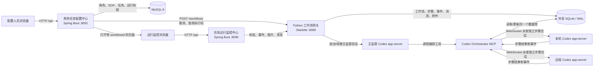
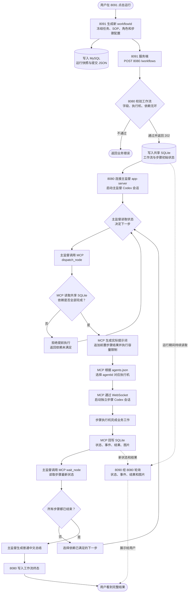
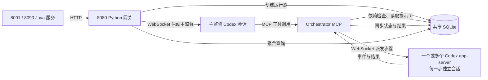
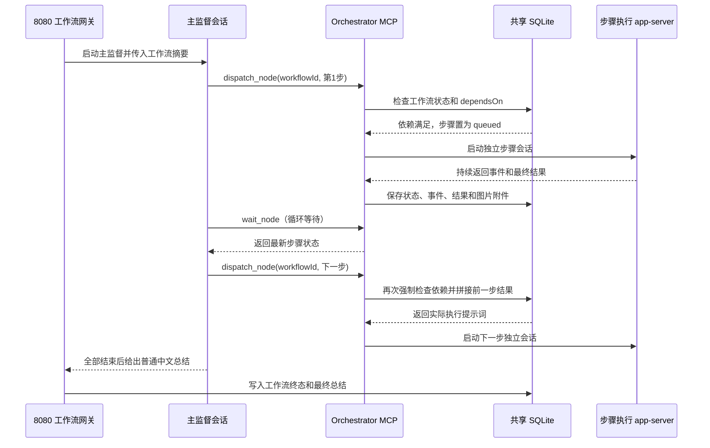

# Codex 多执行机工作流平台架构说明

## 1. 文档目的

本文说明本仓库三个服务如何分工、如何串联，以及一项任务从配置、提交、执行到监控结束的完整链路。

本文以当前实现为准，重点覆盖：

- `role-task-config-center`（8091）：角色任务配置中心。
- `python-workflow`（8080）：工作流网关、主监督调度、MCP 编排器和运行态存储。
- `workflow-console`（8090）：单工作流运行监控中心。
- MySQL、SQLite、Codex app-server 和浏览器在系统中的位置。

## 2. 一句话架构

`8091` 定义任务并向 `8080` 提交，`8080` 调度主监督和各执行步骤，`8090` 从 `8080` 查询并展示指定工作流；MySQL 保存配置及运行快照，SQLite 保存实际运行状态。

## 3. 总体架构



系统存在两类边界：

1. Java 系统只通过 HTTP 调用 Python 网关，不直接调用 MCP、Python 脚本或 app-server WebSocket。
2. 浏览器只调用当前 Java 服务的 `/api`，不直接访问 `8080`、MySQL、SQLite 或执行机。

### 3.1 核心运行流转图（突出 MCP）

下面这张图展示一项任务真正执行时的流转。图中的 MCP 不是新的 HTTP 业务服务，而是主监督会话与各步骤执行机之间的“调度执行桥梁”。



从这条链路可以看出：

- `8080` 负责接收工作流、启动主监督和提供外部查询接口。
- 主监督负责判断“现在应该执行哪一步”，但不直接完成业务工作。
- MCP 负责把主监督的调度决定安全地落实到具体执行机。
- 执行 app-server 负责真正完成某一步的业务任务。
- SQLite 是网关与 MCP 之间共享运行状态的交接面。

### 3.2 MCP 在架构中的准确位置



容易混淆的地方：

1. `8091` 和 `8090` 都不会直接调用 MCP，只调用 `8080`。
2. `8080` 启动主监督会话；主监督会话再调用 MCP 派发业务步骤。
3. MCP 不负责角色、SOP、任务定义或监控页面，也不对浏览器暴露接口。
4. MCP 和网关是两个运行边界，但必须共享同一个 SQLite 文件。
5. MCP 使用 `agents.json` 把逻辑 `agentId` 映射为具体 app-server 地址、默认目录和权限。

## 4. 三个服务的职责

| 服务 | 核心职责 | 持久化 | 可以做什么 | 明确不能做什么 |
| --- | --- | --- | --- | --- |
| `role-task-config-center`（8091） | 管理角色、严格串行 SOP、任务定义和运行记录；生成工作流 JSON；提交、取消和按快照重试 | MySQL 8 | 定义任务、生成不可变运行快照、调用 8080、生成 8090 监控地址 | 浏览器不能直连 8080；不负责实际节点调度；不读取 SQLite |
| `python-workflow`（8080） | 对外提供工作流 HTTP/SSE 边界；校验工作流；启动主监督；处理消息；聚合运行状态 | SQLite（WAL） | 创建工作流、查询状态、保存事件/图片、取消工作流、驱动主监督 | 不保存角色和 SOP 主数据；不提供配置页面 |
| `workflow-console`（8090） | 展示一个 `workflowId` 的进度、步骤结果、图片和任务助手消息 | 无独立业务数据库 | 代理 8080 的查询、事件、图片和消息接口 | 不连接 MySQL；不编辑或提交任务；不提供直接取消、重试、跳过接口 |

## 5. Python 工作流服务的内部结构

`services/python-workflow` 虽然是一个代码模块，但运行时包含相互配合的三个部分。

### 5.1 HTTP 工作流网关

入口文件：`src/workflow_gateway.py`。

主要职责：

- 接收并校验完整工作流 JSON。
- 校验 `workflowId`、节点依赖、执行机、超时、目录和写权限等边界。
- 把工作流初始状态写入 SQLite。
- 通过 Codex app-server 启动主监督会话。
- 提供状态查询、历史事件、SSE、图片附件、任务助手消息和取消接口。
- 将主监督事件、消息和最终结果同步到 SQLite。

### 5.2 Codex Orchestrator MCP

入口文件：`src/codex_orchestrator_mcp.py`。

MCP 由主监督所在的 Codex app-server 加载。主监督不会亲自完成业务步骤，而是调用编排工具：

- `dispatch_node`：在依赖满足后派发步骤。
- `wait_node`：等待步骤完成并同步状态。
- `node_status`：查询某一步骤。
- `cancel_node`：取消某一步骤。
- `workflow_status`：读取整个工作流的用户可读状态。
- 工作流控制工具：提议并在二次确认后执行停止、重试或跳过。

MCP 根据 `agentId` 读取执行机配置，通过 WebSocket 连接对应的本机或远程 Codex app-server。每个步骤使用独立 Codex 会话，避免步骤之间直接共享不可控上下文。

MCP 在一次 `dispatch_node` 调用中具体完成以下工作：

1. 从共享 SQLite 读取工作流和目标步骤，而不是相信主监督重复传入完整配置。
2. 在事务内检查工作流是否已结束、步骤是否已派发、所有 `dependsOn` 是否满足。
3. 读取前置步骤结果，执行 20,000 / 40,000 / 100,000 字符容量限制，生成本次实际提示词。
4. 根据 `agentId`、`cwd`、`write`、`model` 和 `timeoutSec` 连接目标 app-server。
5. 为目标步骤启动一个独立 Codex 会话，并记录作业、会话和执行状态。
6. 收集 app-server 事件；步骤完成后，把结果、错误、状态及生成图片同步到 SQLite。
7. 向主监督返回最新状态，使主监督决定等待、停止或继续派发后续步骤。

因此，MCP 同时承担“依赖执行门禁”“执行机路由器”“步骤会话启动器”和“运行结果同步器”四类职责，但不承担外部 HTTP 网关或业务配置管理职责。

### 5.3 SQLite 状态存储

入口文件：`src/workflow_store.py`。

主要表及用途：

| 表 | 用途 |
| --- | --- |
| `workflows` | 工作流总状态、主监督状态、最终结果和原始规格 |
| `workflow_nodes` | 步骤配置、依赖、实际提示词、执行状态和结果 |
| `workflow_events` | 按递增序号保存网关、主监督和执行步骤事件 |
| `workflow_artifacts` | 保存工作流生成且已验证归属关系的图片附件 |
| `workflow_chat_messages` | 保存监控页面任务助手的用户消息和回复 |
| `workflow_control_actions` | 保存需要二次确认的停止、重试和跳过操作 |

网关进程和 MCP 进程必须使用完全相同的 `CODEX_WORKFLOW_DB` 绝对路径。这是两个进程交换工作流状态的核心条件；路径不一致时，主监督会找不到网关刚创建的工作流。

## 6. 一次任务的完整执行链路

### 6.1 配置和提交

1. 用户在 `8091` 创建角色、SOP 和任务定义。
2. SOP 第一版是严格串行结构：第一步无依赖，后一步只依赖前一步。
3. 用户点击运行后，配置中心生成新的 `workflowId`。
4. 配置中心把任务、角色职责、SOP、步骤最终模型和完整提交 JSON 保存为不可变运行快照。
5. 运行记录先以 `submitting` 状态写入 MySQL。
6. 配置中心服务端调用 `POST http://127.0.0.1:8080/workflows`。
7. 网关接受请求后返回 `202 Accepted`；配置中心记录网关响应，并向前端返回监控地址 `8090/?workflowId=...`。

配置中心生成的核心载荷如下：

```json
{
  "workflowId": "每次运行生成的新 UUID",
  "name": "任务名称",
  "supervisorAgentId": "主监督执行机",
  "failurePolicy": "stop",
  "supervisorTimeoutSec": 7200,
  "nodes": [
    {
      "id": "步骤 ID",
      "displayName": "步骤名称",
      "roleName": "角色名称",
      "executor": {
        "type": "local 或 remote",
        "agentId": "执行机 ID"
      },
      "prompt": "由任务、角色和步骤配置生成的基础提示词",
      "dependsOn": [],
      "write": false,
      "model": "步骤覆盖模型或 SOP 默认模型",
      "timeoutSec": 1800
    }
  ]
}
```

### 6.2 网关创建工作流和主监督

1. 网关规范化并验证请求，包括依赖无环、字段长度和执行机是否存在。
2. `WorkflowStore.create_workflow` 将工作流和全部步骤写入 SQLite。
3. 网关创建异步主监督任务，并在指定 `supervisorAgentId` 的 app-server 上启动主监督会话。
4. 主监督获得工作流摘要和调度规则，但完整步骤提示词仍保存在 SQLite，避免主监督上下文被大量步骤内容撑满。
5. 主监督只负责编排，不代替任何业务步骤完成任务。

### 6.3 主监督派发步骤



关键规则：

- 真正的启动条件由 `dependsOn` 决定，不依赖 JSON 数组顺序。
- 即使主监督错误地提前派发，SQLite 存储层也会拒绝依赖未满足的步骤。
- 后一步派发时，存储层把直接依赖步骤的结果追加到实际提示词。
- 单结果最多传递 20,000 字符，依赖结果合计最多 40,000 字符，最终提示词最多 100,000 字符；截断处会加入明确提示。
- `failurePolicy=stop` 时，任一步骤失败后不再启动后续步骤。
- 步骤执行的工作目录、模型、写权限和超时来自冻结的运行 JSON，不随之后的配置修改而变化。

### 6.4 监控展示

1. 浏览器打开 `http://127.0.0.1:8090/?workflowId=<workflowId>`。
2. 浏览器只请求 `8090/api/...`。
3. 监控中心服务端将请求代理到 `8080`：
   - 查询聚合状态。
   - 使用 `after` 游标增量查询历史事件。
   - 读取已归属当前工作流的图片附件。
   - 发送任务助手消息。
4. 页面默认每 2 秒刷新状态和事件。
5. 页面把内部状态翻译为普通中文，隐藏执行机、会话编号、原始事件和内部英文状态码。
6. 工作流完成且没有待处理消息后停止轮询。

`8090` 不从 `8091` 获取任务数据，也不读取 MySQL；`workflowId` 是它查询运行态的唯一入口。

## 7. 任务助手和控制链路

监控中心允许用户咨询进度，但不暴露直接控制 API。消息链路如下：

```text
浏览器
  → POST 8090/api/workflows/{workflowId}/messages
  → 8090 代理到 8080/workflows/{workflowId}/messages
  → 8080 将消息幂等写入 SQLite
  → 消息工作线程把问题送入原主监督会话
  → 主监督读取最新工作流状态并生成普通中文回复
  → 回复写回 SQLite
  → 8090 后续轮询时展示回复
```

控制操作采用两条独立消息确认：

1. 用户提出“停止任务”“重试某一步”或“跳过某一步”。
2. 主监督只创建控制提议，说明影响并要求另发“确认执行”。
3. 用户发送新的确认消息后，系统核对操作 ID、状态版本、有效期和目标步骤。
4. 核对通过后才执行控制操作，并把结果持久化。

配置中心的取消属于管理端控制链路，可直接由 `8091` 服务端调用 `8080/workflows/{workflowId}/cancel`；这与 `8090` 任务助手的二次确认链路不同。

## 8. 数据归属和一致性

### 8.1 MySQL：配置域和审计快照

MySQL 由 `8091` 独占，保存：

- 角色。
- SOP 和串行步骤。
- Skill/MCP 配置标签。
- 任务定义。
- 每次运行的不可变配置快照。
- 提交给网关的完整 JSON、提交结果和最近一次已知运行状态。

按原快照重试时，配置中心复制历史提交 JSON，仅生成新的 `workflowId`；后续配置修改不会改变旧运行。

### 8.2 SQLite：执行域的事实来源

SQLite 由 `8080` 网关和 MCP 共享，保存实际执行状态、步骤结果、事件、消息、控制动作和图片。对正在运行的工作流，SQLite 是监控页面所见状态的事实来源。

### 8.3 运行内存：活动连接和异步任务

当前活动的 Python 异步任务、Codex app-server WebSocket 连接以及正在执行的作业句柄保存在进程内存中。

因此：

- 服务重启后，SQLite 中的历史状态、事件、结果和消息仍然存在。
- 当前版本不会在崩溃后自动重新附着到原来仍在执行的 Codex 会话。
- 部分聊天处理状态可在网关启动时恢复，但活动步骤的完整自动恢复仍需要租约、心跳和重新附着机制。

## 9. 服务间接口关系

| 调用方 | 被调用方 | 主要接口 | 用途 |
| --- | --- | --- | --- |
| 8091 | 8080 | `POST /workflows` | 提交新工作流 |
| 8091 | 8080 | `GET /agents` | 获取经过脱敏的执行机能力 |
| 8091 | 8080 | `GET /readyz` | 检查网关就绪状态 |
| 8091 | 8080 | `GET /workflows/{id}` | 刷新活动运行的实际状态 |
| 8091 | 8080 | `POST /workflows/{id}/cancel` | 管理端取消运行 |
| 8090 | 8080 | `GET /workflows/{id}` | 查询工作流聚合状态 |
| 8090 | 8080 | `GET /workflows/{id}/events/history` | 按游标读取事件 |
| 8090 | 8080 | `GET /workflows/{id}/artifacts/{artifactId}` | 代理图片附件 |
| 8090 | 8080 | `POST /workflows/{id}/messages` | 发送任务助手消息 |
| 主监督 app-server | MCP | MCP 工具调用 | 派发、等待、查询和控制步骤 |
| MCP | 各执行 app-server | WebSocket RPC | 启动并跟踪独立步骤会话 |

Python 网关还提供 `GET /workflows/{id}/events` SSE 接口；当前 `8090` 页面使用历史事件接口按游标轮询，其他可信客户端可以按需使用 SSE。

## 10. 状态流转

典型工作流状态：

```text
配置中心：submitting
          ↓ 网关接受
运行时：  pending/queued → running → completed
                               ├──→ failed
                               └──→ cancelling → cancelled
```

典型步骤状态：

```text
pending → queued → running → completed
                         ├──→ failed
                         ├──→ interrupted
                         ├──→ cancelling → cancelled
                         └──→ skipped（经确认的控制操作）
```

状态变化和事件写入应保持一致；`stateVersion` 用于识别用户消息接收后工作流是否已发生变化，事件 `sequence` 用于增量查询断点续传。

## 11. 启动顺序

推荐顺序：

1. 启动本机和远程 Codex app-server。
2. 准备 `config/agents.json`，确认执行机 WebSocket 地址、默认目录和权限。
3. 在主监督 app-server 中注册 Codex Orchestrator MCP。
4. 确保网关和 MCP 的 `CODEX_WORKFLOW_DB` 指向同一个绝对路径。
5. 启动 Python 工作流网关 `8080`，检查 `/readyz`。
6. 启动 MySQL 8。
7. 启动角色任务配置中心 `8091`。
8. 启动任务运行监控中心 `8090`。

关键环境变量：

| 组件 | 环境变量 | 说明 |
| --- | --- | --- |
| 网关和 MCP | `CODEX_WORKFLOW_DB` | 两者必须完全一致的 SQLite 绝对路径 |
| 网关和 MCP | `CODEX_AGENTS_FILE` | 执行机配置路径 |
| 8091 | `MYSQL_URL`、`MYSQL_USERNAME`、`MYSQL_PASSWORD` | 配置中心数据库 |
| 8091 | `CODEX_GATEWAY_URL` | 8080 地址 |
| 8091 | `WORKFLOW_MONITOR_URL` | 8090 地址，用于生成跳转链接 |
| 8090 | `CODEX_GATEWAY_URL` | 8080 地址 |

## 12. 安全边界

- 三个 HTTP 服务默认监听 `127.0.0.1`，不得直接暴露到公网。
- 第一版没有登录和多用户授权，应只在本机或受保护的可信内网使用。
- `config/agents.json`、数据库文件、令牌和密码不得提交到 Git。
- 执行机配置只能通过 `token_env` 引用环境变量，不能在 JSON 中直接保存 token。
- `GET /agents` 只返回脱敏后的执行机能力，不返回令牌或认证信息。
- 浏览器不能通过请求参数绕过执行机的 `allow_write` 和 `allow_cwd_override`。
- 图片只能通过工作流和附件 ID 读取，不能把任意本机路径作为下载参数。
- Skill/MCP 字段当前只是配置标签，不会自动安装、启用、授权或注入步骤提示词。

## 13. 故障与恢复边界

| 故障场景 | 当前行为 |
| --- | --- |
| 8090 暂时离线 | 不影响 8080 中的工作流执行；恢复后可按 `workflowId` 继续查看 |
| 8091 暂时离线 | 已提交工作流可继续执行；配置和运行快照仍在 MySQL |
| 8080 暂时不可用 | 8091 不能提交或刷新状态，8090 不能查询；已有 SQLite 数据不丢失 |
| 网关或 MCP 在步骤执行中崩溃 | 最后状态仍在 SQLite，但当前版本不会自动重新附着原活动作业 |
| 某个执行机不可达 | 对应步骤派发失败；在 `stop` 策略下后续步骤不再启动 |
| MySQL 不可用 | 8091 无法管理或提交任务；不直接影响已经由 8080 接管的运行 |
| SQLite 路径配置不一致 | 网关和 MCP 看到不同状态，主监督无法正确调度；必须修正为同一绝对路径 |

## 14. 架构约束

后续演进必须保持以下边界，除非需求明确调整：

1. `8091` 是配置和管理入口，负责提交、取消和重试。
2. `8090` 是单工作流监控入口，不建设全局任务列表和编辑能力。
3. `8080` 是 Java 到 Codex 运行时的唯一 HTTP 边界。
4. 节点依赖由 `dependsOn` 决定，不能依靠数组位置隐式调度。
5. 主监督只编排，不替代业务步骤执行。
6. 运行快照不可变；使用最新配置再次运行必须创建新的快照和 `workflowId`。
7. 配置数据和运行数据分别由 MySQL 与 SQLite 管理，两个 Java 系统不交叉读取数据库。

## 15. 关键代码入口

| 位置 | 作用 |
| --- | --- |
| `services/role-task-config-center/.../application/WorkflowRunService.java` | 配置中心提交、取消、重试和状态刷新编排 |
| `services/role-task-config-center/.../domain/WorkflowRunStore.java` | 生成工作流 JSON，保存不可变运行快照 |
| `services/python-workflow/src/workflow_gateway.py` | HTTP/SSE 网关、主监督和任务助手消息处理 |
| `services/python-workflow/src/codex_orchestrator_mcp.py` | MCP 工具、步骤派发和 app-server 客户端 |
| `services/python-workflow/src/workflow_store.py` | SQLite 模型、状态转换、依赖检查、结果传递 |
| `services/workflow-console/.../client/GatewayClient.java` | 8090 到 8080 的代理客户端 |
| `services/workflow-console/src/main/resources/static/app.js` | 单工作流页面轮询、事件和消息交互 |

## 16. 最简调用链

```text
在 8091 配置角色、SOP 和任务
  → 8091 把运行快照写入 MySQL
  → 8091 服务端 POST 到 8080
  → 8080 把运行态写入共享 SQLite
  → 8080 启动主监督 Codex 会话
  → 主监督通过 MCP 按 dependsOn 派发步骤
  → MCP 连接对应 Codex app-server，每一步使用独立会话
  → 步骤事件、结果、图片持续写入 SQLite
  → 8090 通过 8080 查询并展示指定 workflowId
  → 全部步骤结束，主监督生成总结，8080 写入终态
```

相关详细协议和产品边界参见：

- `docs/WORKFLOW_GUIDE.zh-CN.md`
- `docs/TWO_JAVA_WEB_SYSTEMS_REQUIREMENTS.zh-CN.md`
